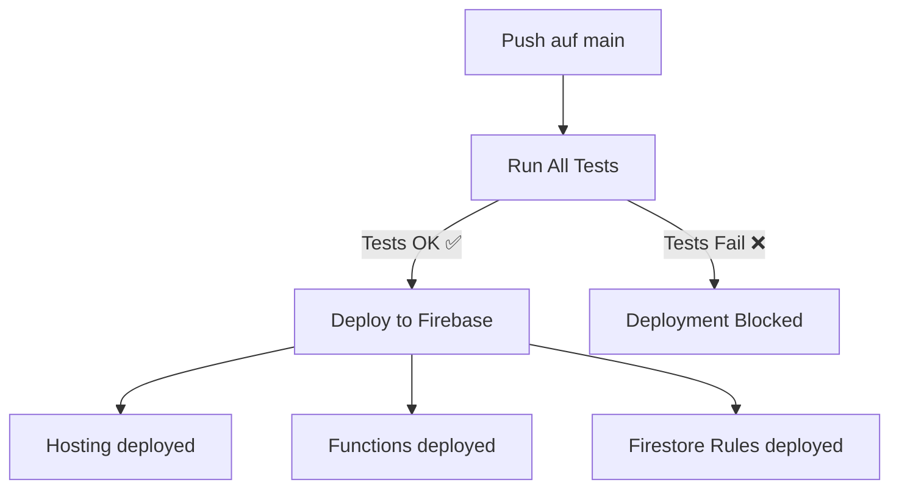

# CI/CD Pipeline für TTV Champions Web

## 📋 Übersicht

Dieses Projekt verwendet **GitHub Actions** für automatisierte Tests und Deployment.

### Workflows

| Workflow | Datei | Trigger | Zweck |
|----------|-------|---------|-------|
| **Tests** | `test.yml` | Push/PR auf `main` | Führt alle Tests aus (Backend + Frontend) |
| **Deploy** | `deploy.yml` | Push auf `main` (nur nach Tests) | Deployed zu Firebase |

---

## 🔄 Workflow: Tests (`test.yml`)

### Was wird getestet?

1. **Backend Tests (Jest)** - 44 Tests
   - Elo-Berechnung (`calculateElo`)
   - Gate-Protection (`getHighestEloGate`, `applyEloGate`)
   - Season Points, Handicap-Matches
   - Integration-Tests

2. **Frontend Tests (Vitest)** - 61 Tests
   - Set-Score-Validierung (`isValidSet`)
   - Match-Validierung (`validateMatch`)
   - Handicap-Berechnung (`calculateHandicap`)
   - Edge Cases

3. **Code Quality**
   - ESLint (Backend)
   - Coverage Reports

### Wann läuft der Test-Workflow?

- ✅ Bei jedem **Push** auf `main`
- ✅ Bei jedem **Pull Request** nach `main`
- ✅ Manuell über GitHub Actions UI

### Was passiert bei Test-Fehler?

❌ **Pull Request wird blockiert** - Merge ist nicht möglich
❌ **Deployment wird verhindert** - Code geht nicht in Produktion
✅ **Coverage Reports** werden hochgeladen (Artifacts)

---

## 🚀 Workflow: Deployment (`deploy.yml`)

### Ablauf



### Voraussetzungen

1. **Firebase Token** muss als Secret hinterlegt sein
2. **Alle Tests** müssen bestehen
3. **Push** auf `main` Branch

### Deployment-Schritte

1. ✅ Backend Tests ausführen (Jest)
2. ✅ Frontend Tests ausführen (Vitest)
3. ✅ Firebase CLI installieren
4. ✅ Firebase Deployment ausführen
5. ✅ Success-Nachricht ausgeben

---

## 🔧 Setup-Anleitung

### 1. Firebase Token generieren

```bash
# Lokal ausführen:
firebase login:ci
```

Das gibt dir einen Token wie:
`1//0dH...xyz123`

### 2. GitHub Secret hinzufügen

1. Gehe zu deinem GitHub Repository
2. **Settings** → **Secrets and variables** → **Actions**
3. Klicke **New repository secret**
4. Name: `FIREBASE_TOKEN`
5. Value: Der Token von oben
6. **Add secret**

### 3. Workflows aktivieren

Die Workflows werden automatisch aktiviert, sobald du sie pushst!

```bash
git add .github/workflows/
git commit -m "Add CI/CD workflows"
git push
```

### 4. Branch Protection einrichten (Optional)

Gehe zu: **Settings** → **Branches** → **Add branch protection rule**

Für `main` Branch:
- ✅ **Require a pull request before merging**
- ✅ **Require status checks to pass before merging**
  - Wähle: `Backend Tests (Jest)`
  - Wähle: `Frontend Tests (Vitest)`
- ✅ **Require branches to be up to date before merging**

---

## 📊 Test-Coverage ansehen

Nach jedem Workflow-Lauf:

1. Gehe zu **Actions** → Workflow auswählen
2. Klicke auf den Job
3. Unter **Artifacts** findest du:
   - `backend-coverage` - Coverage-Report für Backend
   - `frontend-test-results` - Test-Resultate Frontend

---

## 🛠️ Lokale Tests ausführen

### Backend Tests (Jest)

```bash
cd functions
npm test              # Alle Tests
npm run test:watch    # Watch-Modus
npm run test:coverage # Mit Coverage
```

### Frontend Tests (Vitest)

```bash
npm test              # Alle Tests
npm run test:watch    # Watch-Modus (interaktiv)
npm run test:ui       # UI-Modus (Browser)
```

### Alle Tests zusammen

```bash
# Backend
cd functions && npm test && cd ..

# Frontend
npm test
```

---

## 📈 Status Badges (Optional)

Füge diese Badges in dein `README.md` ein:

```markdown


```

---

## 🔍 Troubleshooting

### Problem: Tests schlagen fehl in CI, aber lokal funktionieren sie

**Lösung:**
- Prüfe Node.js-Version (sollte 20 sein)
- Prüfe, ob `package-lock.json` committed ist
- Führe lokal `npm ci` statt `npm install` aus

### Problem: Firebase Deployment schlägt fehl

**Lösung:**
- Prüfe, ob `FIREBASE_TOKEN` Secret korrekt gesetzt ist
- Prüfe Firebase CLI Version: `firebase --version`
- Token erneuern: `firebase login:ci`

### Problem: ESLint-Fehler blockieren Tests

**Lösung:**
- Lokale ESLint-Fehler beheben: `npm run lint --fix`
- Oder temporär `continue-on-error: true` in Workflow setzen

---

## 📝 Best Practices

1. ✅ **Nie direkt auf `main` pushen** - Immer Pull Requests nutzen
2. ✅ **Tests lokal ausführen** bevor du pushst
3. ✅ **Branch Protection Rules** aktivieren
4. ✅ **Coverage Reports** regelmäßig prüfen
5. ✅ **Secrets sicher verwalten** - Nie in Code committen!

---

## 🎯 Zusammenfassung

### Was haben wir erreicht?

- ✅ **Automatisierte Tests** bei jedem Push/PR
- ✅ **Deployment nur bei erfolgreichen Tests**
- ✅ **Coverage Reports** für besseren Überblick
- ✅ **Branch Protection** verhindert fehlerhafte Merges
- ✅ **Schnelles Feedback** bei Code-Änderungen

### Vorteile

1. **Qualitätssicherung** - Keine fehlerhaften Deployments
2. **Schnelligkeit** - Automatische Prozesse
3. **Transparenz** - Alle Tests sichtbar in GitHub
4. **Sicherheit** - Tests laufen in isolierter Umgebung

---

**Erstellt:** 2025-01-08
**Version:** 1.0
**Maintainer:** @Walacont
